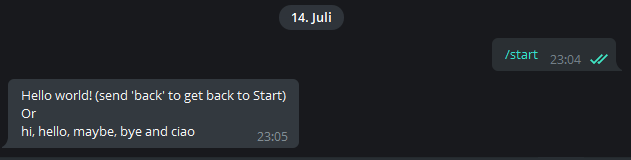
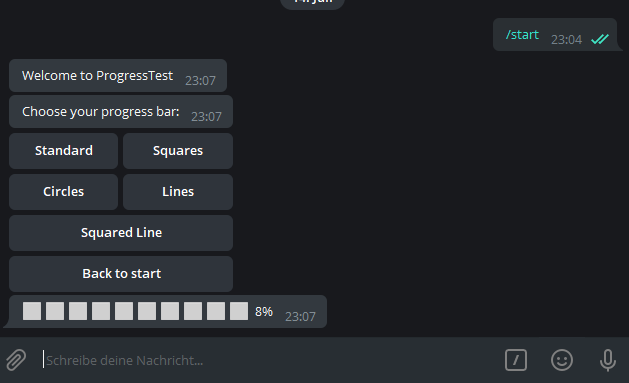
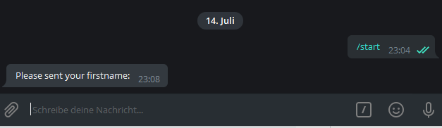
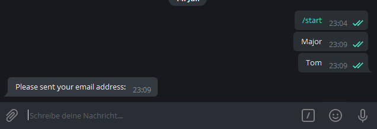
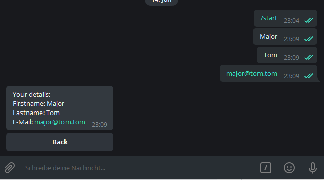
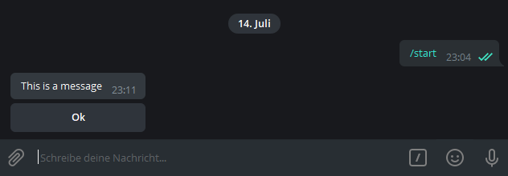
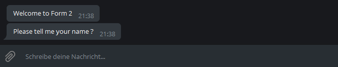

# .NET Telegram Bot Framework - Context based addon

[](https://www.nuget.org/packages/TelegramBotBase/)
[](https://www.t.me/tgbotbase)

[](https://raw.githubusercontent.com/MajMcCloud/TelegramBotFramework/master/LICENCE.md)
[](https://www.nuget.org/packages/TelegramBotBase)

**Showcase: [@TGBaseBot](https://t.me/TGBaseBot)**

**Support group: [@tgbotbase](https://t.me/tgbotbase)**

**Discord Server: [https://discord.gg/V3PxreDYfE](https://discord.gg/V3PxreDYfE)**

**Releases: [GitHub](https://github.com/MajMcCloud/TelegramBotFramework/releases)**

## Donate

Paypal: [https://paypal.me/majmccloud](https://paypal.me/majmccloud)

Bitcoin: `1GoUJYMwAvBipQTfw2FKydAz12J8RDyeJs` / `bc1qqwlp0p5ley29lsu6jhe0qv7s7963kfc7d0m53d`

Etherium: `0xAf3835104c2C3E5b3e721FA2c7365955e87DB931`

Litecoin: `LRhF1eB7kneFontcDRDU8YjJhEm2GoYHch`

Dashcoin: `XudiUwWtSmAJj1QDdVW7jocQumJFLsyoGZ`

Tron: `TYVZSykaVT1nKZnz9hjDgBRNB9VavU1bpW`

BitTorrent: `TYVZSykaVT1nKZnz9hjDgBRNB9VavU1bpW`

---

## Index

- [Quick start](#quick-start)
- [Simplified builder](#simplified-builder)
- [Features](#features)
    * [System calls & bot commands](#system-calls--bot-commands)
    * [Text messages handling](#text-messages)
    * [Buttons](#buttons)
    * [Custom controls](#custom-controls)
    * [Forms advanced](#forms-advanced)
- [Special Forms](#forms)
    * [AlertDialog](#alert-dialog)
    * [AutoCleanForm](#autocleanform)
    * [PromptDialog](#prompt-dialog)
    * [ConfirmDialog](#confirm-dialog)
- [Controls](#controls)
    * [Label](#label)
    * [ProgressBar](#progress-bar)
    * [CalendarPicker](#calendar-picker)
    * [MonthPicker](#month-picker)
    * [TreeView](#tree-view)
    * [ToggleButton](#toggle-button)
    * [ButtonGrid](#button-grid)
        * [Paging and Searching](#paging--searching)
    * [TaggedButtonGrid](#tagged-button-grid)
    * [CheckedButtonList](#checked-button-list)
    * [MultiToggleButton](#multi-toggle-button)
- [Localizations](#localizations)
- [Groups](#groups)
    * [SplitterForm](#splitter-form)
    * [GroupForm](#group-form)
- [State Machine and Session Serialization (v3.0.0)](#statemachine-and-sessions)
    * [StateMachines](#statemachines)
        * [SimpleJSONStateMachine](#simplejsonstatemachine)
        * [JSONStateMachine](#jsonstatemachine)
        * [XMLStateMachine](#xmlstatemachine)
    * [Interfaces](#interfaces)
        * [IStateMachine](#istatemachine)
        * [IStateForm](#istateform)
    * [Attributes](#attributes)
        * [SaveState](#savestate)
        * [IgnoreState](#ignorestate)
- [Navigation and NavigationController (v4.0.0)](#navigation-and-navigationcontroller)
    * [As of Now](#as-of-now)
    * [Usage](#usage)
- [Extensions](#extensions)
- [Test Project](#test-project)
- [Examples](#examples)

---

## Quick start

First of all, create a new empty dotnet console project and paste some code:

```csharp
// public async Task Main(string[] args)

var bot = BotBaseBuilder
    .Create()
    .WithAPIKey("{YOUR API KEY}") // do not store your API key as plain text in project sources
    .DefaultMessageLoop()
    .WithStartForm<StartForm>()
    .NoProxy()
    .CustomCommands(a =>
    {
        a.Start("Starts the bot");
    })
    .NoSerialization()
    .UseEnglish()
    .Build();

// Upload bot commands to BotFather
await bot.UploadBotCommands();

// Start your Bot
await bot.Start();
```

The `BotBase` class will manage a lot of things for you, like bot commands, action events and so on.
`StartForm` is your first form which every user will get internally redirected to, *just like a start page*.
It needs to be a subclass of `FormBase` you will find in namespace `TelegramBotBase.Base`

Every `Form` has some events which will get raised at specific times.
In every form, you are able to get notes about
the *Remote Device*,
like ChatId and other stuff your carrying.
From there you build up your bots:

```csharp
public class StartForm : FormBase
{
    // Gets invoked during Navigation to this form
    public override async Task PreLoad(MessageResult message)
    {
    }

    // Gets invoked on every Message/Action/Data in this context
    public override async Task Load(MessageResult message)
    {
        // `Device` is a wrapper for current chat - you can easily respond to the user
        await this.Device.Send("Hello world!");
    }

    // Gets invoked on edited messages
    public override async Task Edited(MessageResult message)
    {
    }

    // Gets invoked on Button clicks
    public override async Task Action(MessageResult message)
    {
    }

    // Gets invoked on Data uploades by the user (of type Photo, Audio, Video, Contact, Location, Document)
    public override async Task SentData(DataResult data)
    {
    }

    //Gets invoked on every Message/Action/Data to render Design or Response 
    public override async Task Render(MessageResult message)
    {
    }
}
```

Send a message after loading a specific form:

```csharp
await this.Device.Send("Hello world!");
```

Want to go to a different form?
Go ahead, create it, initialize it and navigate to it:

```csharp
var form = new TestForm();
await this.NavigateTo(form);
```

## Simplified builder

When migrating from a previous version or starting completely new, all these options can be a bit overwhelming.
There's a function called `QuickStart` that simplifies building a bit.

```csharp
var bot = BotBaseBuilder
    .Create()
    .QuickStart<StartForm>("{YOUR API KEY}")
    .Build();

await bot.Start();
```

## Features

### System calls & bot commands

Using BotFather you can add *Commands* to your bot. The user will see them as popups in a dialog.
Before starting (and later, for sure), you could add them to your BotBase.
If the message contains a command, a special *event handler* will get raised.

Below we have 4 commands.

`/start` - opens the start form

`/form1` - navigates in this context to form1

`/form2` - navigates in this context to form2

`/params` - demonstrates the use of parameters per command (i.e. /params 1 2 3 test ...)

```csharp
var bot = BotBaseBuilder
    .Create()
    .WithAPIKey("{YOUR API KEY}")
    .DefaultMessageLoop()
    .WithStartForm<Start>()
    .NoProxy()
    .CustomCommands(a =>
    {
        a.Start("Starts the bot");
        a.Add("form1","Opens test form 1");
        a.Add("form2", "Opens test form 2");
        a.Add("params", "Returns all send parameters as a message.");
    })
    .NoSerialization()
    .UseEnglish()
    .Build();

bot.BotCommand += async (s, en) =>
{
    switch (en.Command)
    {
        case "/form1":
            var form1 = new TestForm();
            await en.Device.ActiveForm.NavigateTo(form1);
            break;

        case "/form2":
            var form2 = new TestForm2();
            await en.Device.ActiveForm.NavigateTo(form2);
            break;

        case "/params":
            string m = en.Parameters.DefaultIfEmpty("").Aggregate((a, b) => a + " and " + b);
            await en.Device.Send("Your parameters are " + m, replyTo: en.Device.LastMessage);
            break;
    }
};

await bot.UploadBotCommands() 

await bot.Start();
```

On every input the user is sending back to the bot, the `Action` event gets raised. So here we could manage to send
something back to him.

### Text messages



```csharp
public class SimpleForm : AutoCleanForm
{
    public SimpleForm()
    {
        this.DeleteSide = TelegramBotBase.Enums.eDeleteSide.Both;
        this.DeleteMode = TelegramBotBase.Enums.eDeleteMode.OnLeavingForm;

        this.Opened += SimpleForm_Opened;
    }

    private async Task SimpleForm_Opened(object sender, EventArgs e)
    {
        await this.Device.Send("Hello world! (send 'back' to get back to Start)\r\nOr\r\nhi, hello, maybe, bye and ciao");
    }

    public override async Task Load(MessageResult message)
    {
        // message.MessageText will work also, cause it is a string you could manage a lot different scenerios here
        var messageId = message.MessageId;

        switch (message.Command)
        {
            case "hello":
            case "hi":
                // Send a simple message
                await this.Device.Send("Hello you there !");
                break;
    
            case "maybe":
                // Send a simple message and reply to the one of himself
                await this.Device.Send("Maybe what?", replyTo: messageId);
                break;
    
            case "bye":
            case "ciao":
                // Send a simple message
                await this.Device.Send("Ok, take care !");
                break;
        }
    }
}
```

### Buttons


```csharp
public class ButtonTestForm : AutoCleanForm
{
    public override async Task Opened()
    {
        await this.Device.Send("Hello world! (Click 'back' to get back to Start)");
    }

    public override async Task Action(MessageResult message)
    {
        var call = message.GetData<CallbackData>();
        await message.ConfirmAction();

        if (call == null)
            return;

        message.Handled = true;

        switch (call.Value)
        {
            case "button1":
                await this.Device.Send("Button 1 pressed");
                break;

            case "button2":
                await this.Device.Send("Button 2 pressed");
                break;

            case "button3":
                await this.Device.Send("Button 3 pressed");
                break;

            case "button4":
                await this.Device.Send("Button 4 pressed");
                break;

            case "back":
                var st = new Start();
                await this.NavigateTo(st);
                break;

            default:
                message.Handled = false;
                break;
        }
    }

    public override async Task Render(MessageResult message)
    {
        ButtonForm btn = new ButtonForm();

        btn.AddButtonRow(new ButtonBase("Button 1", new CallbackData("a", "button1").Serialize()), new ButtonBase("Button 2", new CallbackData("a", "button2").Serialize()));
        btn.AddButtonRow(new ButtonBase("Button 3", new CallbackData("a", "button3").Serialize()), new ButtonBase("Button 4", new CallbackData("a", "button4").Serialize()));
        btn.AddButtonRow(new ButtonBase("Google.com", "google", "https://www.google.com"), new ButtonBase("Telegram", "telegram", "https://telegram.org/"));
        btn.AddButtonRow(new ButtonBase("Back", new CallbackData("a", "back").Serialize()));

        await this.Device.Send("Click a button", btn);
    }
}
```

### Custom controls

There is a bunch of ready to use controls. For example, progress bar.



```csharp
public class ProgressTest : AutoCleanForm
{
    public ProgressTest()
    {
        this.DeleteMode = eDeleteMode.OnLeavingForm;
    }

    public override async Task Opened()
    {
        await this.Device.Send("Welcome to ProgressTest");
    }

    public override async Task Action(MessageResult message)
    {
        var call = message.GetData<CallbackData>();
        await message.ConfirmAction();

        if (call == null) return;

        TelegramBotBase.Controls.ProgressBar Bar = null;

        switch (call.Value)
        {
            case "standard":
                Bar = new TelegramBotBase.Controls.ProgressBar(0, 100, TelegramBotBase.Controls.ProgressBar.eProgressStyle.standard);
                Bar.Device = this.Device;
                break;

            case "squares":
                Bar = new TelegramBotBase.Controls.ProgressBar(0, 100, TelegramBotBase.Controls.ProgressBar.eProgressStyle.squares);
                Bar.Device = this.Device;
                break;

            case "circles":
                Bar = new TelegramBotBase.Controls.ProgressBar(0, 100, TelegramBotBase.Controls.ProgressBar.eProgressStyle.circles);
                Bar.Device = this.Device;
                break;

            case "lines":
                Bar = new TelegramBotBase.Controls.ProgressBar(0, 100, TelegramBotBase.Controls.ProgressBar.eProgressStyle.lines);
                Bar.Device = this.Device;
                break;

            case "squaredlines":
                Bar = new TelegramBotBase.Controls.ProgressBar(0, 100, TelegramBotBase.Controls.ProgressBar.eProgressStyle.squaredLines);
                Bar.Device = this.Device;
                break;

            case "start":
                var sf = new Start();
                await sf.Init();
                await this.NavigateTo(sf);
                return;

            default:
                return;
        }

        // Render Progress bar and show some "example" progress
        await Bar.Render();

        this.Controls.Add(Bar);

        for (int i = 0; i <= 100; i++)
        {
            Bar.Value++;
            await Bar.Render();

            Thread.Sleep(250);
        }
    }

    public override async Task Render(MessageResult message)
    {
        ButtonForm btn = new ButtonForm();

        btn.AddButtonRow(new ButtonBase("Standard", new CallbackData("a", "standard").Serialize()), new ButtonBase("Squares", new CallbackData("a", "squares").Serialize()));
        btn.AddButtonRow(new ButtonBase("Circles", new CallbackData("a", "circles").Serialize()), new ButtonBase("Lines", new CallbackData("a", "lines").Serialize()));
        btn.AddButtonRow(new ButtonBase("Squared Line", new CallbackData("a", "squaredlines").Serialize()));
        btn.AddButtonRow(new ButtonBase("Back to start", new CallbackData("a", "start").Serialize()));

        await this.Device.Send("Choose your progress bar:", btn);
    }

    public override async Task Closed()
    {
        foreach (var b in this.Controls)
        {
            await b.Cleanup();
        }

        await this.Device.Send("Ciao from ProgressTest");
    }
}
```

### Forms advanced

Registration forms have never been so easy.








```csharp
public class PerForm : AutoCleanForm
{
    public string EMail { get; set; }

    public string Firstname { get; set; }

    public string Lastname { get; set; }

    public async override Task Load(MessageResult message)
    {
        if (string.IsNullOrWhiteSpace(message.MessageText)) return;

        if (this.Firstname == null)
        {
            this.Firstname = message.MessageText;
            return;
        }

        if (this.Lastname == null)
        {
            this.Lastname = message.MessageText;
            return;
        }

        if (this.EMail == null)
        {
            this.EMail = message.MessageText;
            return;
        }
    }

    public async override Task Action(MessageResult message)
    {
        var call = message.GetData<CallbackData>();
        await message.ConfirmAction();

        if (call == null) return;

        switch (call.Value)
        {
            case "back":
                var start = new Start();
                await this.NavigateTo(start);
                break;
        }
    }

    public async override Task Render(MessageResult message)
    {
        if (this.Firstname == null)
        {
            await this.Device.Send("Please sent your firstname:");
            return;
        }

        if (this.Lastname == null)
        {
            await this.Device.Send("Please sent your lastname:");
            return;
        }

        if (this.EMail == null)
        {
            await this.Device.Send("Please sent your email address:");
            return;
        }

        string s = "";

        s += "Firstname: " + this.Firstname + "\r\n";
        s += "Lastname: " + this.Lastname + "\r\n";
        s += "E-Mail: " + this.EMail + "\r\n";

        ButtonForm bf = new ButtonForm();
        bf.AddButtonRow(new ButtonBase("Back", new CallbackData("a", "back").Serialize()));

        await this.Device.Send("Your details:\r\n" + s, bf);
    }
}
```

[Another case](TelegramBotBase.Test/Tests/Register/PerStep.cs), where every of these 3 inputs gets requested by 
different forms. Just for
imagination of the possibilities.

## Forms

There are some default forms to make the interaction with users easier.

- [AlertDialog](#alert-dialog)
  Just a simple dialog with one Button.

- [AutoCleanForm](#autocleanform)
  A form which needs to be derived from. It will be delete all in the context sent messages to the user after every new
  message or on leaving the form and navigates somewhere else.
  Makes sense to create a *feeling* of a clean environment for the user. For instance if you have a multilevel menu.
  This will remove the previously shown menu, and renders the new sub/top level.

- [PromptDialog](#prompt-dialog)
  A simple dialog which will show a message and then wait for a text input (response).

- [ConfirmDialog](#confirm-dialog)
  A simple dialog which is able to show multiple buttons and a text message. The user could select one option and will
  get redirected to a different form, depending on the click.

### Alert Dialog



```csharp
AlertDialog ad = new AlertDialog("This is a message", "Ok");

ad.ButtonClicked += async (s, en) =>
{
    var fto = new TestForm2();
    await this.NavigateTo(fto);
};

await this.NavigateTo(ad);
```

### AutoCleanForm

Just try it by yourself.

### Prompt Dialog



```csharp
PromptDialog pd = new PromptDialog("Please tell me your name ?");

pd.Completed += async (s, en) =>
{
    await this.Device.Send("Hello " + pd.Value);
};

await this.OpenModal(pd);
```

### Confirm Dialog


```csharp
ConfirmDialog cd = new ConfirmDialog("Please confirm", new ButtonBase("Ok", "ok"), new ButtonBase("Cancel", "cancel"));

cd.ButtonClicked += async (s, en) =>
{
    var tf = new TestForm2();

    // Remember only to navigate from the current running form. (here it is the prompt dialog, cause we have left the above already)
    await cd.NavigateTo(tf);
};

await this.NavigateTo(cd);
```

## Controls

### Label

A minimal control which allows to manage a classic "text" message and update its later without having to keep track of the message id.


Check the example project [TelegramBotBase.Test/Tests/Controls/LabelForm.cs](TelegramBotBase.Test/Tests/Controls/LabelForm.cs)

### Progress Bar


Check the example project [TelegramBotBase.Test/Tests/ProgressTest.cs](TelegramBotBase.Test/Tests/ProgressTest.cs)

### Calendar Picker


Check the example project [TelegramBotBase.Test/Tests/Controls/CalendarPickerForm.cs](TelegramBotBase.Test/Tests/Controls/CalendarPickerForm.cs)

### Month Picker


Check the example project [TelegramBotBase.Test/Tests/Controls/MonthPickerForm.cs](TelegramBotBase.Test/Tests/Controls/MonthPickerForm.cs)

### Tree View


    

Check the example project [TelegramBotBase.Test/Tests/Controls/TreeViewForms.cs](TelegramBotBase.Test/Tests/Controls/TreeViewForms.cs)

### Toggle Button


Check the example project [TelegramBotBase.Test/Tests/Controls/ToggleButtonForm.cs](TelegramBotBase.Test/Tests/Controls/ToggleButtonForm.cs)

### Button Grid


Check the example project [TelegramBotBase.Test/Tests/Controls/ButtonGridForm.cs](TelegramBotBase.Test/Tests/Controls/ButtonGridForm.cs)

#### Paging & Searching


Check the example project [TelegramBotBase.Test/Tests/Controls/ButtonGridPadingForm.cs](TelegramBotBase.Test/Tests/Controls/ButtonGridPagingForm.cs)

### Tagged Button Grid


Check the example project [TelegramBotBase.Test/Tests/Controls/ButtonGridTagForm.cs](TelegramBotBase.Test/Tests/Controls/ButtonGridTagForm.cs)

### Checked Button List


Check the example project [TelegramBotBase.Test/Tests/Controls/CheckedButtonListForm.cs](TelegramBotBase.Test/Tests/Controls/CheckedButtonListForm.cs)

### Multi Toggle Button


Check the example project [TelegramBotBase.Test/Tests/Controls/MultiToggleButtonForm.cs](TelegramBotBase.Test/Tests/Controls/MultiToggleButtonForm.cs)


## Localizations

The current available languages for controls are:

- English
- German
- Persian

You can add other languages easily by creating a subclass of the [TelegramBotBase/Localizations/Localization.cs](TelegramBotBase/Localizations/Localization.cs) class.

To set the default language set the *Language* property on the static [TelegramBotBase/Localizations/Default.cs](TelegramBotBase/Localizations/Default.cs) instance.

## Groups

For groups, there are multiple different tools which help to work with and allows bot also to manage
"Single-User" chats and group chats.

### Splitter Form

An easy way to switch between a *Single-User* form and one for managing a group is the SplitterForm base class.
It calls special methods which you can override and then move from there to the form you need.

The OpenGroup method is the *backup* if OpenChannel or OpenSupergroup is not overridden. Same for Open, it is "backup"
if none of the previous methods has been overridden.

```csharp
public class Start : SplitterForm
{
    public override async Task<bool> Open(MessageResult e)
    {
        var st = new Menu();
        await this.NavigateTo(st);

        return true;
    }

    public override async Task<bool> OpenGroup(MessageResult e)
    {
        var st = new Groups.LinkReplaceTest();
        await this.NavigateTo(st);

        return true;
    }

    public override Task<bool> OpenChannel(MessageResult e)
    {
        return base.OpenChannel(e);
    }

    public override Task<bool> OpenSupergroup(MessageResult e)
    {
        return base.OpenSupergroup(e);
    }
}
```

### Group Form

For managing groups there's a base class called `GroupForm`. This one has special events which should make it
easier to work with groups and channels.
In the Example project there's a simple example for deleting an url written by a user and incrementing an internal
counter. At
every url he writes he gets blocked for a small amount of time and the message gets deleted. At 3 failures, the user
gets
kicked of the group and blocked.

```csharp
public class GroupForm : FormBase
{
    public override async Task Load(MessageResult message)
    {
        switch (message.MessageType)
        {
            case Telegram.Bot.Types.Enums.MessageType.ChatMembersAdded:
                await OnMemberChanges(new MemberChangeEventArgs(Telegram.Bot.Types.Enums.MessageType.ChatMembersAdded, message, message.RawMessageData.Message.NewChatMembers));
                break;

            case Telegram.Bot.Types.Enums.MessageType.ChatMemberLeft:
                await OnMemberChanges(new MemberChangeEventArgs(Telegram.Bot.Types.Enums.MessageType.ChatMemberLeft, message, message.RawMessageData.Message.LeftChatMember));
                break;

            case Telegram.Bot.Types.Enums.MessageType.ChatPhotoChanged:
            case Telegram.Bot.Types.Enums.MessageType.ChatPhotoDeleted:
            case Telegram.Bot.Types.Enums.MessageType.ChatTitleChanged:
            case Telegram.Bot.Types.Enums.MessageType.MigratedFromGroup:
            case Telegram.Bot.Types.Enums.MessageType.MigratedToSupergroup:
            case Telegram.Bot.Types.Enums.MessageType.MessagePinned:
            case Telegram.Bot.Types.Enums.MessageType.GroupCreated:
            case Telegram.Bot.Types.Enums.MessageType.SupergroupCreated:
            case Telegram.Bot.Types.Enums.MessageType.ChannelCreated:
                await OnGroupChanged(new GroupChangedEventArgs(message.MessageType, message));
                break;

            default:
                OnMessage(message);
                break;
        }
    }

    public virtual async Task OnMemberChanges(MemberChangeEventArgs e)
    {
    }

    public virtual async Task OnGroupChanged(GroupChangedEventArgs e)
    {
    }

    public virtual async Task OnMessage(MessageResult e)
    {
    }
}
```

## Statemachine and Sessions

Depending on the use-cases and the overall structure of a Telegram Bot, it is essential to have some kind of session
serialization or state machine to keep the user context after bot restarts (i.e. due to updates) or crashes.
For this, we have some structures which fit into the current environment.

### Statemachines

There are actually 3 types of example state machines you could use. A state machine is a kind of serializer which saves
the important session data in a reusable structure like JSON or XML.

#### SimpleJSONStateMachine

Is easy to use and useful for simple structures like basic datatypes. Won't work for complex ones like generics.

```csharp
var bot = BotBaseBuilder
    .Create()
    .WithAPIKey("{YOUR API KEY}")
    .DefaultMessageLoop()
    .WithStartForm<StartForm>()
    .NoProxy()
    .CustomCommands(a =>
    {
        a.Start("Starts the bot");
    })
    .UseSimpleJSON(AppContext.BaseDirectory + "config\\states.json")
    .UseEnglish()
    .Build();

await bot.Start();
```

#### JSONStateMachine

It is easy to use too, but it works for complex datatypes, because it saves their namespaces and additional type info
into the JSON file.

```csharp
var bot = BotBaseBuilder
    .Create()
    .WithAPIKey("{YOUR API KEY}")
    .DefaultMessageLoop()
    .WithStartForm<StartForm>()
    .NoProxy()
    .CustomCommands(a =>
    {
        a.Start("Starts the bot");
    })
    .UseJSON(AppContext.BaseDirectory + "config\\states.json")
    .UseEnglish()
    .Build();

await bot.Start();
```

#### XMLStateMachine

The last one should work like the others.

```csharp
var bot = BotBaseBuilder
    .Create()
    .WithAPIKey("{YOUR API KEY}")
    .DefaultMessageLoop()
    .WithStartForm<StartForm>()
    .NoProxy()
    .CustomCommands(a =>
    {
        a.Start("Starts the bot");
    })
    .UseXML(AppContext.BaseDirectory + "config\\states.xml")
    .UseEnglish()
    .Build();

await bot.Start();
```

### Interfaces

There are two interfaces, one for the StateMachine itself, which is useful to build a custom one for a different
datatype and one for implementing into a form which should be invoked with events.

#### IStateMachine

Is the basic StateMachine interface, it has two methods `SaveFormStates(SaveStatesEventArgs e)`
and `StateContainerLoadFormStates()`, nothing fancy, just simple calls. Implement both methods with your own
serialization process.

```csharp
public interface IStateMachine
{
    void SaveFormStates(SaveStatesEventArgs e);

    StateContainer LoadFormStates();
}
```

#### IStateForm

When implemented, this will invoke one of these two methods: `LoadState(LoadStateEventArgs e)`
or `SaveState(SaveStateEventArgs e)`.
They have methods to load or save data from the statemachine of the current form.

```csharp
public interface IStateForm
{
    void LoadState(LoadStateEventArgs e);
    void SaveState(SaveStateEventArgs e);
}
```

### Attributes

If you don't want to implement the `IStateForm` interface, because there are maybe *just* one or two properties you want
to
keep and restore, use the following attributes.

#### SaveState

This will let the engine know that you want to keep and restore this field automatically. Unlike the IStateForm
methods, you have no option to manipulate data.

```csharp
[SaveState]
public long UserId { get; set; }
```

#### IgnoreState

Due to the fact that Attribute implementation and interaction is optional, you want to let the engine maybe know that
you don't want to keep a specific form. So it should get *lost*. This attribute will help you here, add it to the form
class, and it will not get serialized, even if it implements IStateForm or the SaveState attributes.

```csharp
[IgnoreState]
public class Registration : STForm
{
}
```

## Navigation and NavigationController

### As of now

As from earlier topics on this readme you already know the default way for (cross) navigation between Forms.
It will look something like this:

```csharp
var f = new FormBase();
await this.NavigateTo(f);
```

Depending on the model and structure of your bot, it can make sense, to have more linear navigation instead of *cross*-navigation.

For example, you have a bot which shows a list of football teams. And when clicking on it, you want to open the team
details and the latest matches.

After the matches, you want to maybe switch to different teams and take a look at their statistics and matches.

At some point, you *just* want to get back to the first team, so like on Android you're clicking the "back" button
multiple
times.

This can become really complicated, when not having some controller below which handle these "Push/Pop" calls.

That's why we have a NavigationController class which manages these situations and the stack.

### Usage

First, you need to create a NavigationController instance at the same position in code, where you want to start the
navigation.

You will use the current FormBase instance as a root class within the constructor, so you can later come back to this
one.

**Tip**: *You can also add a completely new instance of i.e. a main menu form here to get back to it then. So you are
free to choose.*

We are using the same `FormBase` instance as above.

```csharp
var nc = new NavigationController(this);
var f = new FormBase();

// Replace the current form in the context with the controller.
await this.NavigateTo(nc);

// Push the new from onto the stack to render it
nc.PushAsync(f);
```

Later to open a new form use `PushAsync` again:

```csharp
await this.NavigationController.PushAsync(newForm);
```

When you want to go back one Form on the stack use `PopAsync`:

```csharp
await this.NavigationController.PopAsync();
```

**Notice**: *By default the `NavigationController` has `ForceCleanupOnLastPop` enabled, which means that when the stack
is
again at 1 (due to `PopAsync` or `PopToRootAsync` calls) it will replace the controller automatically with the root form
you
have given to the constructor at the beginning.*

## Extensions

### TelegramBotBase.Extensions.Images

Extends the base package with some additional image methods like SendPhoto (using Bitmap)

[](https://www.nuget.org/packages/TelegramBotBase.Extensions.Images/)
[](https://www.nuget.org/packages/TelegramBotBase.Extensions.Images)

[https://www.nuget.org/packages/TelegramBotBase.Extensions.Images/](https://www.nuget.org/packages/TelegramBotBase.Extensions.Images/)

### TelegramBotBase.Extensions.Images.IronSoftware

Extends the base package with some additional image methods like SendPhoto (using Bitmap)

Important: This extension uses the IronSoftware drawing library.

[](https://www.nuget.org/packages/TelegramBotBase.Extensions.Images.IronSoftware/)
[](https://www.nuget.org/packages/TelegramBotBase.Extensions.Images.IronSoftware)

[https://www.nuget.org/packages/TelegramBotBase.Extensions.Images.IronSoftware/](https://www.nuget.org/packages/TelegramBotBase.Extensions.Images.IronSoftware/)

### TelegramBotBase.Extensions.Serializer.Database.MSSQL

A session serializer for Microsoft SQL Server.

[](https://www.nuget.org/packages/TelegramBotBase.Extensions.Serializer.Database.MSSQL/)
[](https://www.nuget.org/packages/TelegramBotBase.Extensions.Serializer.Database.MSSQL)

[https://www.nuget.org/packages/TelegramBotBase.Extensions.Serializer.Database.MSSQL/](https://www.nuget.org/packages/TelegramBotBase.Extensions.Serializer.Database.MSSQL/)

## Test Project

There is a "TelegramBotBase.Test" project inside the repository which includes minimal examples for all controls available.
Check it out to get a brief overview about all possibilities.


- [TelegramBotBase.Test](TelegramBotBase.Test)

## Examples

You can find all example projects in the "Examples" subfolder.

Will allow you to run specific system commands or run/kill processes via Bot. Also has a simple authentication mechanism
with one password.

- [Examples/SystemCommandsBot](Examples/SystemCommandsBot)

Example using minimal dotnet console template with EntityFramework and Dependency Injection.

- [Examples/EFCoreBot](Examples/EFCoreBot)

Will delete Join and Leave messages automatically in groups.

- [Examples/JoinHiderBot](Examples/JoinHiderBot)

When you want to update forms async without any user interaction (message/action) before. Use the new InvokeMessageLoop
method of BotBase.

- [Examples/AsyncFormUpdates](Examples/AsyncFormUpdates)


Having already a web application and want to add a TelegramBot side-by-side with it running ? Here is an example how you could do it.

- [Examples/BotAndWebApplication](Examples/BotAndWebApplication)

Want to use Inline- and ReplyMarkup at the same time ? Here is an example how you can do that:

- [Examples/InlineAndReplyCombination](Examples/InlineAndReplyCombination)


Alpha: Full Dependency Injection example within this framework.

- [Examples/DependencyInjection](Examples/DependencyInjection)
