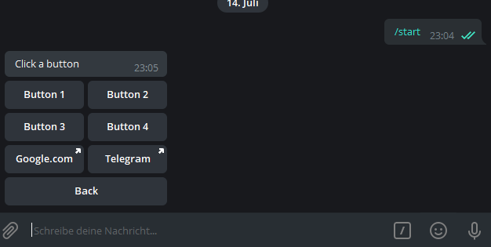
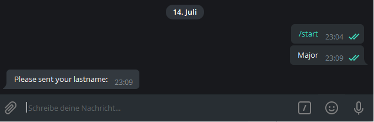
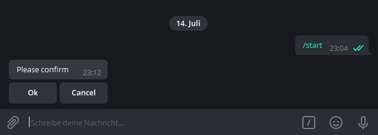

# .Net Telegram Bot Framework - Context based addon

[](https://www.nuget.org/packages/TelegramBotBase/)
[](https://www.t.me/tgbotbase)


[](https://raw.githubusercontent.com/MajMcCloud/TelegramBotFramework/master/LICENCE.md)
[](https://www.nuget.org/packages/TelegramBotBase)

Test the Testproject: [@TGBaseBot](https://www.t.me/TGBaseBot)

Join the Telegram Group: [https://www.t.me/tgbotbase](https://www.t.me/tgbotbase)

Download a release: [Releases](https://github.com/MajMcCloud/TelegramBotFramework/releases)

---

Donations

Bitcoin: 1GoUJYMwAvBipQTfw2FKydAz12J8RDyeJs / bc1qqwlp0p5ley29lsu6jhe0qv7s7963kfc7d0m53d

ETH: 0xAf3835104c2C3E5b3e721FA2c7365955e87DB931

Litecoin: LRhF1eB7kneFontcDRDU8YjJhEm2GoYHch

DASH: XudiUwWtSmAJj1QDdVW7jocQumJFLsyoGZ

TRON: TYVZSykaVT1nKZnz9hjDgBRNB9VavU1bpW

BITTORRENT: TYVZSykaVT1nKZnz9hjDgBRNB9VavU1bpW


Thanks !

---

## Index
- [Introduction](#introduction)
- [How to Start](#how-to-start)
- [Quick Start](#quick-start)
- [Message Handling](#message-handling)
    * [Example #0 - System Calls](#add-some-system-calls-example-0---system-calls)

    * [Example #1 - Simple text messages](#lets-start-with-text-messages-example-1---simple-test)

    * [Example #2 - Button test](#now-some-buttons-example-2---button-test)

    * [Example #3 - Progress Bar control](#now-some-controls-example-3---progress-bar-test)

    * [Example #4 - Registration Formular](#registration-example-example-4---registration-form-test)

- [Special Forms](#forms)

	* [AlertDialog](#alert-dialog)
	
	* [AutoCleanForm](#autocleanform)
	
	* [PromptDialog](#prompt-dialog)

	* [ConfirmDialog](#confirm-dialog)

- [Controls](#controls)
	* [ProgressBar](#progress-bar)
	
	* [CalendarPicker](#calendar-picker)
	
	* [MonthPicker](#month-picker)
	
	* [TreeView](#tree-view)

	* [ToggleButton](#toggle-button)

	* [ButtonGrid](#button-grid)
	
		* [Paging and Searching](#paging--searching)

    * [TaggedButtonGrid](#tagged-button-grid)

    * [CheckedButtonList](#checked-button-list)

    * [MultiToggleButton](#multi-toggle-button)

- [Groups](#groups)
	* [SplitterForm](#splitter-form)

    * [GroupForm](#group-form)

- [State Machine and Session Serialization (v3.0.0)](#statemachine-and-sessions)

    * [StateMachines](#statemachines)
    
        * [SimpleJSONStateMachine](#simplejsonstatemachine)
	
        * [JSONStateMachine](#jsonstatemachine)
	
        * [XMLStateMachine](#xmlstatemachine)

    * [Interfaces](#interfaces)
    
        * [IStateMachine](#istatemachine)
	
        * [IStateForm](#istateform)

    * [Attributes](#attributes)

        * [SaveState](#savestate)
	
        * [IgnoreState](#ignorestate)
	

- [Navigation and NavigationController (v4.0.0)](#navigation-and-navigationcontroller)

    * [As of Now](#as-of-now)

    * [How to use](#how-to-use-)


- [Extensions](#extensions)

- [Examples](#examples)

---

## Introduction

Hey guys,

here we are. After some time and thoughts i give my TelegramBot framework  to public.
It is based on C#.

It is a module which is based on the original [TelegramBotLibrary](https://github.com/TelegramBots/Telegram.Bot) you will find in nuget.

It gives you features which will look/feel like WinForms or have a good way to create apps with actions and forms.

---

## How to start:

Within your empty App your need to put some initial lines including your APIKey to get things started. 
The "BotBase" Class will manage a lot of things for you, like bot commands, action events and so on. 
"StartForm" is your first Formular which every user will get internally redirected to, like a start page, you could redirect from there later in code, so users won't recognize it. 
It needs to be a subclass of "FormBase" you will find in Namespace TelegramBotBase.Base


```

//Prepare the System (New in V5)
var bb = BotBaseBuilder
    .Create()
    .WithAPIKey("{YOUR API KEY}")
    .DefaultMessageLoop()
    .WithStartForm<StartForm>()
    .NoProxy()
    .CustomCommands(a =>
    {
        a.Start("Starts the bot")

    })
    .NoSerialization()
    .UseEnglish()
    .Build();

//Update bot commands to botfather
bb.UploadBotCommands().Wait();

//Start your Bot
bb.Start();

```

Every Form has some events which will get raised at specific times. On every form you are able to get notes about the "Remote Device" like ChatId and other stuff your carrying. From there you build up you apps:

```
public class StartForm : FormBase
{


        public override async Task PreLoad(MessageResult message)
        {

        }
		
	    //Gets invoked during Navigation to this form

        //Init() got replaced with event handler
		
    	//Opened() got replaced with event handler

    	//Closed() got replaced with event handler

		
	//Gets invoked on every Message/Action/Data in this context
        public override async Task Load(MessageResult message)
        {
            await this.Device.Send("Hello world!");
        }
	
	//Gets invoked on edited messages
	public override async Task Edited(MessageResult message)
        {
            
        }
		
	//Gets invoked on Button clicks
        public override async Task Action(MessageResult message)
        {


        }
		
	//Gets invoked on Data uploades by the user (of type Photo, Audio, Video, Contact, Location, Document)
	public override async Task SentData(DataResult data)
        {


	}
		
	//Gets invoked on every Message/Action/Data to render Design or Response 
        public override async Task Render(MessageResult message)
        {

        }

}

```

For instance send a message after loading a specific form:

```
await this.Device.Send("Hello world!");
```

Or you want to goto a different form?
Go ahead, create it, initialize it and navigate to it:

```
var tf = new TestForm();

await this.NavigateTo(tf);
```

## Quick Start:


When migrating from a previous version or starting completely new, all these options can be a bit overwhelming.
For this I added a QuickStart option, directly after the Create call. It just need basic parameters like in earlier versions.


```

//Prepare the System (New in V5)
var bb = BotBaseBuilder
    .Create()
    .QuickStart<StartForm>("{YOUR API KEY}")
    .Build();

//Start your Bot
bb.Start();

```


## Message Handling

All examples are within the test project, so just try it out on your own.

### Add some system calls (Example #0 - Bot Commands)

Inside of the BotFather you are able to add "Commands" to your TelegramBot. The user will see them, depending on the application as options he could choose.
Before start (and later for sure) you could add them to your BotBase. Every time a message comes in they will get checked if they are one of them.
If so, a special event Handler will get raised where you are easier able to manage the action behind.

Below we have 4 options.

/start - opens the Startformular

/form1 - navigates in this context to form1

/form2 - navigates in this context to form2

/params - demonstrates the use of parameters per command (i.e. /params 1 2 3 test ...)


```
var bb = BotBaseBuilder
    .Create()
    .WithAPIKey("{YOUR API KEY}")
    .DefaultMessageLoop()
    .WithStartForm<Start>()
    .NoProxy()
    .CustomCommands(a =>
    {
        a.Start("Starts the bot");
        a.Add("form1","Opens test form 1" );
        a.Add("form2", "Opens test form 2" );
        a.Add("params", "Returns all send parameters as a message." );


    })
    .NoSerialization()
    .UseEnglish()
    .Build();

bb.BotCommand += async (s, en) =>
{
	switch (en.Command)
	{
	    case "/form1":

		var form1 = new TestForm();

		await en.Device.ActiveForm.NavigateTo(form1);

		break;

	    case "/form2":

		var form2 = new TestForm2();

		await en.Device.ActiveForm.NavigateTo(form2);

		break;

	    case "/params":

		String m = en.Parameters.DefaultIfEmpty("").Aggregate((a, b) => a + " and " + b);

		await en.Device.Send("Your parameters are " + m, replyTo: en.Device.LastMessage);

		break;
	}

};

//Update Bot commands to botfather
bb.UploadBotCommands().Wait();

bb.Start();

```


On every input the user is sending back to the bot the Action event gets raised. So here we could manage to send something back to him. For sure we could also manage different button inputs:

### Lets start with text messages (Example #1 - Simple Test)


```
public class SimpleForm : AutoCleanForm
{
    public SimpleForm()
    {
        this.DeleteSide = TelegramBotBase.Enums.eDeleteSide.Both;
        this.DeleteMode = TelegramBotBase.Enums.eDeleteMode.OnLeavingForm;

        this.Opened += SimpleForm_Opened;
    }
	
    private async Task SimpleForm_Opened(object sender, EventArgs e)
    {
        await this.Device.Send("Hello world! (send 'back' to get back to Start)\r\nOr\r\nhi, hello, maybe, bye and ciao");
    }


    public override async Task Load(MessageResult message)
	{
	    //message.MessageText will work also, cause it is a string you could manage a lot different scenerios here

	    var messageId = message.MessageId;

	    switch (message.Command)
	    {
		case "hello":
		case "hi":

		    //Send him a simple message
		    await this.Device.Send("Hello you there !");
		    break;

		case "maybe":

		    //Send him a simple message and reply to the one of himself
		    await this.Device.Send("Maybe what?", replyTo: messageId);

		    break;

		case "bye":
		case "ciao":

		    //Send him a simple message
		    await this.Device.Send("Ok, take care !");
		    break;
	    }
	}
}

```

### Now some buttons (Example #2 - Button Test)

I using a different base class (AutoCleanForm) I created for a better "feeling" inside the bot which will delete "old" messages from this form. You have some settings within this class to manage when messages should be getting deleted.



```
public class ButtonTestForm : AutoCleanForm
{

        public override async Task Opened()
        {
            await this.Device.Send("Hello world! (Click 'back' to get back to Start)");
        }

        public override async Task Action(MessageResult message)
        {

            var call = message.GetData<CallbackData>();

            await message.ConfirmAction();


            if (call == null)
                return;

            message.Handled = true;

            switch (call.Value)
            {
                case "button1":

                    await this.Device.Send("Button 1 pressed");

                    break;

                case "button2":

                    await this.Device.Send("Button 2 pressed");

                    break;

                case "button3":

                    await this.Device.Send("Button 3 pressed");

                    break;

                case "button4":

                    await this.Device.Send("Button 4 pressed");

                    break;

                case "back":

                    var st = new Start();

                    await this.NavigateTo(st);

                    break;

                default:

                    message.Handled = false;

                    break;
            }


        }


        public override async Task Render(MessageResult message)
        {

            ButtonForm btn = new ButtonForm();

            btn.AddButtonRow(new ButtonBase("Button 1", new CallbackData("a", "button1").Serialize()), new ButtonBase("Button 2", new CallbackData("a", "button2").Serialize()));

            btn.AddButtonRow(new ButtonBase("Button 3", new CallbackData("a", "button3").Serialize()), new ButtonBase("Button 4", new CallbackData("a", "button4").Serialize()));

	    btn.AddButtonRow(new ButtonBase("Google.com", "google", "https://www.google.com"), new ButtonBase("Telegram", "telegram", "https://telegram.org/"));

            btn.AddButtonRow(new ButtonBase("Back", new CallbackData("a", "back").Serialize()));

            await this.Device.Send("Click a button", btn);


        }
}

```

### Now some controls (Example #3 - Progress Bar Test)

Sometimes it makes sense to show the end user a type of progressbar or status. For this i tried to make a simple control, which is useful for some situations.
Maybe, if i  got more ideas, i will add other "controls" in the future.


```

public class ProgressTest : AutoCleanForm
{

public ProgressTest()
{
    this.DeleteMode = eDeleteMode.OnLeavingForm;
}

public override async Task Opened()
{
    await this.Device.Send("Welcome to ProgressTest");
}

public override async Task Action(MessageResult message)
{
    var call = message.GetData<CallbackData>();

    await message.ConfirmAction();


    if (call == null)
	return;

    TelegramBotBase.Controls.ProgressBar Bar = null;

    switch (call.Value)
    {
	case "standard":

	    Bar = new TelegramBotBase.Controls.ProgressBar(0, 100, TelegramBotBase.Controls.ProgressBar.eProgressStyle.standard);
	    Bar.Device = this.Device;

	    break;

	case "squares":

	    Bar = new TelegramBotBase.Controls.ProgressBar(0, 100, TelegramBotBase.Controls.ProgressBar.eProgressStyle.squares);
	    Bar.Device = this.Device;

	    break;

	case "circles":

	    Bar = new TelegramBotBase.Controls.ProgressBar(0, 100, TelegramBotBase.Controls.ProgressBar.eProgressStyle.circles);
	    Bar.Device = this.Device;

	    break;

	case "lines":

	    Bar = new TelegramBotBase.Controls.ProgressBar(0, 100, TelegramBotBase.Controls.ProgressBar.eProgressStyle.lines);
	    Bar.Device = this.Device;

	    break;

	case "squaredlines":

	    Bar = new TelegramBotBase.Controls.ProgressBar(0, 100, TelegramBotBase.Controls.ProgressBar.eProgressStyle.squaredLines);
	    Bar.Device = this.Device;

	    break;

	case "start":

	    var sf = new Start();

	    await sf.Init();

	    await this.NavigateTo(sf);

	    return;

	default:

	    return;

    }


    //Render Progress bar and show some "example" progress
    await Bar.Render();

    this.Controls.Add(Bar);

    for (int i = 0; i <= 100; i++)
    {
	Bar.Value++;
	await Bar.Render();

	Thread.Sleep(250);
    }


}


public override async Task Render(MessageResult message)
{
    ButtonForm btn = new ButtonForm();
    btn.AddButtonRow(new ButtonBase("Standard", new CallbackData("a", "standard").Serialize()), new ButtonBase("Squares", new CallbackData("a", "squares").Serialize()));

    btn.AddButtonRow(new ButtonBase("Circles", new CallbackData("a", "circles").Serialize()), new ButtonBase("Lines", new CallbackData("a", "lines").Serialize()));

    btn.AddButtonRow(new ButtonBase("Squared Line", new CallbackData("a", "squaredlines").Serialize()));

    btn.AddButtonRow(new ButtonBase("Back to start", new CallbackData("a", "start").Serialize()));

    await this.Device.Send("Choose your progress bar:", btn);
}

public override async Task Closed()
{
    foreach (var b in this.Controls)
    {
	await b.Cleanup();
    }

    await this.Device.Send("Ciao from ProgressTest");
}


}


```

### Registration Example (Example #4 - Registration Form Test)

I read it a lot in different Telegram groups that some developers are searching for easy solutions to create context based apps. For this is my project an ideal solution here.
To give you an example about the possiblities, i added into the Test project an example for a registration form.





```

public class PerForm : AutoCleanForm
{
public String EMail { get; set; }

public String Firstname { get; set; }

public String Lastname { get; set; }

public async override Task Load(MessageResult message)
{
    if (message.MessageText.Trim() == "")
	return;

    if (this.Firstname == null)
    {
	this.Firstname = message.MessageText;
	return;
    }

    if (this.Lastname == null)
    {
	this.Lastname = message.MessageText;
	return;
    }

    if (this.EMail == null)
    {
	this.EMail = message.MessageText;
	return;
    }

}

public async override Task Action(MessageResult message)
{
    var call = message.GetData<CallbackData>();

    await message.ConfirmAction();

    if (call == null)
	return;

    switch (call.Value)
    {
	case "back":

	    var start = new Start();

	    await this.NavigateTo(start);

	    break;

    }


}

public async override Task Render(MessageResult message)
{
    if (this.Firstname == null)
    {
	await this.Device.Send("Please sent your firstname:");
	return;
    }

    if (this.Lastname == null)
    {
	await this.Device.Send("Please sent your lastname:");
	return;
    }

    if (this.EMail == null)
    {
	await this.Device.Send("Please sent your email address:");
	return;
    }


    String s = "";

    s += "Firstname: " + this.Firstname + "\r\n";
    s += "Lastname: " + this.Lastname + "\r\n";
    s += "E-Mail: " + this.EMail + "\r\n";

    ButtonForm bf = new ButtonForm();
    bf.AddButtonRow(new ButtonBase("Back", new CallbackData("a", "back").Serialize()));

    await this.Device.Send("Your details:\r\n" + s, bf);
}


}

```

There is also a second example, where every of these 3 inputs gets requested by a different formular (class). Just for imagination of the possiblites.
Cause its to much Text, i didnt have added it here. You will find it under [TelegramBotBaseTest/Tests/Register/PerStep.cs](TelegramBotBaseTest/Tests/Register/PerStep.cs)
Beginn there and navigate your way through these Steps in the subfolder.


---


## Forms

There are some default types of forms to make the interaction with users easier.
For now we have the following:

- [AlertDialog](#alert-dialog)
	Just a simple dialog with one Button.

- [AutoCleanForm](#autocleanform)
	A form which needs to be derived from. It will be delete all in the context sent messages to the user after every new message or on leaving the formular and navigates somewhere else.
	Makes sense to create a "feeling" of a clean environment for the user. For instance if you have a multilevel menu. This will remove the previously shown menu, and renders the new sub/top level.

- [PromptDialog](#prompt-dialog)
	A simple dialog which will show a message and then waits for a text input (response).

- [ConfirmDialog](#confirm-dialog)
	A simple dialog which is able to show multiple buttons and a Text message. The user could select one option and will get redirected to a different form, depending on the click.

### Alert Dialog


```

AlertDialog ad = new AlertDialog("This is a message", "Ok");

ad.ButtonClicked += async (s, en) =>
{
    var fto = new TestForm2();
    await this.NavigateTo(fto);
};

await this.NavigateTo(ad);

```


### AutoCleanForm

No example yet

### Prompt Dialog


```

PromptDialog pd = new PromptDialog("Please tell me your name ?");

pd.Completed += async (s, en) =>
{
	await this.Device.Send("Hello " + pd.Value);
};

await this.OpenModal(pd);

```

### Confirm Dialog




```

ConfirmDialog cd = new ConfirmDialog("Please confirm", new ButtonBase("Ok", "ok"), new ButtonBase("Cancel", "cancel"));

cd.ButtonClicked += async (s, en) =>
{
    var tf = new TestForm2();

    //Remember only to navigate from the current running form. (here it is the prompt dialog, cause we have left the above already)
    await cd.NavigateTo(tf);
};

await this.NavigateTo(cd);

```


## Controls

### Progress Bar


### Calendar Picker


### Month Picker


	
	
### Tree View


	
	

### Toggle Button


### Button Grid


#### Paging & Searching


### Tagged Button Grid


### Checked Button List


### Multi Toggle Button


## Groups

For working with groups, there are multiple different tools which helps to work with and allows bot also to manage "Single-User" chats and group chats.

### Splitter Form


An easy way to switch between a "Single-User" form and one for managing a group is the SplitterForm base class.
It calls special methods which you can override and then move from there to the form you need.

The OpenGroup method is the "backup" if OpenChannel or OpenSupergroup is not overridden. Same for Open, it is "backup" if none of the previous methods has been overridden.


```

public class Start : SplitterForm
{
        public override async Task<bool> Open(MessageResult e)
        {
            var st = new Menu();
            await this.NavigateTo(st);

            return true;
        }


        public override async Task<bool> OpenGroup(MessageResult e)
        {
            var st = new Groups.LinkReplaceTest();
            await this.NavigateTo(st);

            return true;
        }
		
        public override Task<bool> OpenChannel(MessageResult e)
        {
            return base.OpenChannel(e);
        }

        public override Task<bool> OpenSupergroup(MessageResult e)
        {
            return base.OpenSupergroup(e);
        }
}
	
```


### Group Form

For managing groups im introducing a new base class called "GroupForm". This one has special events which should make it easier to work with groups and channels.
In the Example project is a simple example for deleting a url written by a user and incrementing an internal counter. At every url he writes he got blocked for a small amount of time and the messages gots deleted. At 3 "failes" the user gets kicked of the group and blocked.

```
public class GroupForm : FormBase
{


        public override async Task Load(MessageResult message)
        {
            switch (message.MessageType)
            {
                case Telegram.Bot.Types.Enums.MessageType.ChatMembersAdded:

                    await OnMemberChanges(new MemberChangeEventArgs(Telegram.Bot.Types.Enums.MessageType.ChatMembersAdded, message, message.RawMessageData.Message.NewChatMembers));

                    break;
                case Telegram.Bot.Types.Enums.MessageType.ChatMemberLeft:

                    await OnMemberChanges(new MemberChangeEventArgs(Telegram.Bot.Types.Enums.MessageType.ChatMemberLeft, message, message.RawMessageData.Message.LeftChatMember));

                    break;

                case Telegram.Bot.Types.Enums.MessageType.ChatPhotoChanged:
                case Telegram.Bot.Types.Enums.MessageType.ChatPhotoDeleted:
                case Telegram.Bot.Types.Enums.MessageType.ChatTitleChanged:
                case Telegram.Bot.Types.Enums.MessageType.MigratedFromGroup:
                case Telegram.Bot.Types.Enums.MessageType.MigratedToSupergroup:
                case Telegram.Bot.Types.Enums.MessageType.MessagePinned:
                case Telegram.Bot.Types.Enums.MessageType.GroupCreated:
                case Telegram.Bot.Types.Enums.MessageType.SupergroupCreated:
                case Telegram.Bot.Types.Enums.MessageType.ChannelCreated:

                    await OnGroupChanged(new GroupChangedEventArgs(message.MessageType, message));

                    break;

                default:

                    OnMessage(message);

                    break;
            }


        }

        public virtual async Task OnMemberChanges(MemberChangeEventArgs e)
        {

        }


        public virtual async Task OnGroupChanged(GroupChangedEventArgs e)
        {

        }


        public virtual async Task OnMessage(MessageResult e)
        {

        }
}
```


## Statemachine and Sessions

Depending on the usecases and the overall structure of a Telegram Bot it is essential to have some kind of session serialization or state machine to keep the user context after restarts of the bot (ie. due to updates) or crashes.
For this I have created some easy to implement structures which fits into the current environment.

Below you find all possiblities.

### Statemachines

There are actually 3 types of example state machines you could use. A state machine is a kind of serializer which saves the important session data in a reusable structure like JSON or XML.

You could use one of the following state machines:

#### SimpleJSONStateMachine
Is easy to use and useful for simple structures like basic datatypes. Did not work for complex ones like generics. Use the JSONStateMachine for them.
In general you didn't need to do more then, to keep the actual form:

```
//Prepare the System
var bb = BotBaseBuilder
    .Create()
    .WithAPIKey("{YOUR API KEY}")
    .DefaultMessageLoop()
    .WithStartForm<StartForm>()
    .NoProxy()
    .CustomCommands(a =>
    {
        a.Start("Starts the bot");
    })
    .UseSimpleJSON(AppContext.BaseDirectory + "config\\states.json")
    .UseEnglish()
    .Build();

//Start your Bot
bb.Start();

```

#### JSONStateMachine
Is easy to use too, but works for complex datatypes cause it saves there namespaces and additional type informations into the JSON file too.
In general you didn't need to do more then, to keep the actual form:

```
//Prepare the System
var bb = BotBaseBuilder
    .Create()
    .WithAPIKey("{YOUR API KEY}")
    .DefaultMessageLoop()
    .WithStartForm<StartForm>()
    .NoProxy()
    .CustomCommands(a =>
    {
        a.Start("Starts the bot");
    })
    .UseJSON(AppContext.BaseDirectory + "config\\states.json")
    .UseEnglish()
    .Build();

//Start your Bot
bb.Start();

```

#### XMLStateMachine

The last one, should work like the others. 
In general you didn't need to do more then, to keep the actual form:

```
//Prepare the System
var bb = BotBaseBuilder
    .Create()
    .WithAPIKey("{YOUR API KEY}")
    .DefaultMessageLoop()
    .WithStartForm<StartForm>()
    .NoProxy()
    .CustomCommands(a =>
    {
        a.Start("Starts the bot");
    })
    .UseXML(AppContext.BaseDirectory + "config\\states.xml")
    .UseEnglish()
    .Build();

//Start your Bot
bb.Start();

```

### Interfaces

There are two interfaces, one for the StateMachine itself, which is useful to build a custom one for a different datatype and one for implementing into a form which should be invoked with events.

#### IStateMachine

Is the basic StateMachine interface, it has two methods SaveFormStates(SaveStatesEventArgs e) and StateContainer LoadFormStates(), nothing fancy, just simple calls. Implement into both methods your own serialization process.

```

public interface IStateMachine
{
    void SaveFormStates(SaveStatesEventArgs e);

    StateContainer LoadFormStates();
}

```


#### IStateForm

When implemented, this will invoke one of these two methods: LoadState(LoadStateEventArgs e) or SaveState(SaveStateEventArgs e).
They have methods to load or save data from the statemachine of the current form.

```

public interface IStateForm
{
    void LoadState(LoadStateEventArgs e);

    void SaveState(SaveStateEventArgs e);
}

```

### Attributes

If you don't want to implement the IStateForm interface, cause there are maybe "just" one or two properties you want to keep and restore, use the following attribute:

#### SaveState

This will let the engine know, that you want too keep and restore this field automatically. Unlike the IStateForm methods, you have no option to manipulate data.

```

[SaveState]
public long UserId { get; set; }


```

#### IgnoreState

Due to the fact that Attribute implementation and interaction is optional, you want to let the engine maybe know, that you don't want to keep a specific form. So it should get "lost". This attribute will help you here, add it to the form class and it will not get serialized, even if it implements IStateForm or the SaveState attributes.

```

[IgnoreState]
public class Registration : STForm
{

}

```

## Navigation and NavigationController

### As of now

As from earlier topics on this readme you already know the default way for (cross) navigation between Forms.
It will look something like this:

```

var f = new FormBase();
await this.NavigateTo(f);

```

Depending on the model and structure of your bot it can make sense, to have more linear navigation instead of "cross" navigation.

In example you have a bot which shows a list of football teams. And when clicking on it you want to open the team details and latest matches.

After the matches you want to maybe switch to a different teams and take a look at their statistics and matches.

At some point, you "just" want to get back to the first team so like on Android your clicking the "back" button multiple times.

This can become really complicated, when not having some controller below which handle these "Push/Pop" calls.

Thats why I introduced a NavigationController class which manages these situations and the stack.


### How to use ?

First you need to create a NavigationController instance at the same position in code, where you want to start the navigation.

You will use the current FormBase instance as a root class within the constructor. So you can later come back to this one.

**Tip**: *You can add also a completely new instance of i.e. a main menu form here to get back to it then. So you are free to choose.*

We are using the same FormBase instance as above.


```

var nc = new NavigationController(this);

var f = new FormBase();

//Replace the current form in the context with the controller.
await this.NavigateTo(nc);

//Push the new from onto the stack to render it
nc.PushAsync(f);

```


Later to open a new form use PushAsync again:

```

await this.NavigationController.PushAsync(newForm);

```

When you want to go back one Form on the stack use PopAsync:


```

await this.NavigationController.PopAsync();

```

**Notice**: *By default the NavigationController has ForceCleanupOnLastPop enabled, which means that when the stack is again at 1 (due to PopAsync or PopToRootAsync calls) it will replace the controller automatically with the root form you have given to the constructor at the beginning.*

## Extensions

### TelegramBotBase.Extensions.Images

Extends the base package with some additional image methods like SendPhoto (with Bitmap)

[](https://www.nuget.org/packages/TelegramBotBase.Extensions.Images/)
[](https://www.nuget.org/packages/TelegramBotBase.Extensions.Images)


[https://www.nuget.org/packages/TelegramBotBase.Extensions.Images/](https://www.nuget.org/packages/TelegramBotBase.Extensions.Images/)


### TelegramBotBase.Extensions.Serializer.Database.MSSQL

A session serializer for Microsoft SQL Server.

[](https://www.nuget.org/packages/TelegramBotBase.Extensions.Serializer.Database.MSSQL/)
[](https://www.nuget.org/packages/TelegramBotBase.Extensions.Serializer.Database.MSSQL)


[https://www.nuget.org/packages/TelegramBotBase.Extensions.Serializer.Database.MSSQL/](https://www.nuget.org/packages/TelegramBotBase.Extensions.Serializer.Database.MSSQL/)


## Examples

You find all example projects in the "Examples" subfolder.

- [Examples/SystemCommandsBot/](Examples/SystemCommandsBot/) 

Will allow you to run specific system commands or run/kill processes via Bot. Has also a simple authentication mechanism with one password.

- [Examples/JoinHiderBot/](Examples/JoinHiderBot/) 

Will delete Join and Leave messages automatically in groups.

- [Examples/AsyncFormUpdates/](Examples/AsyncFormUpdates/) 

When you want to update forms async without any user interaction (message/action) before. Use the new InvokeMessageLoop method of BotBase.

---

I will add more notes to it soon, so stay tuned.

Warm regards

Florian Dahn

